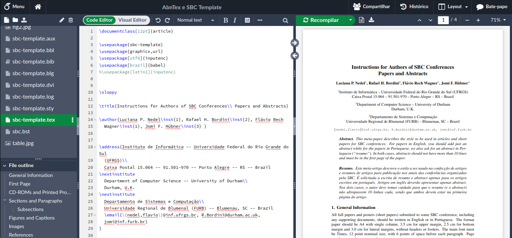

# 🧪 Overleaf Docker Edition 🐳

🚀 Ambiente Docker pronto para uso do Overleaf Community Edition, permitindo edição colaborativa de documentos LaTeX diretamente no navegador!

📝 Este projeto oferece uma configuração completa do Docker Compose para executar sua própria instância do Overleaf, com suporte especial para os templates ABNT2 e SBC (Sociedade Brasileira de Computação).



### ✨ Características:

- 📦 Configuração completa com MongoDB e Redis
- 🔧 Scripts e instruções detalhadas para configuração pós-instalação
- 📚 Suporte para normas ABNT2 utilizadas pela SBC com pacotes LaTeX pré-configurados
- 💾 Persistência de dados através de volumes Docker
- 🔒 Ambiente isolado e seguro para seus projetos acadêmicos

## 📋 Pré-requisitos
- Docker e Docker Compose instalados
- Mínimo de 4GB de RAM recomendado
- Aproximadamente 10GB de espaço em disco livre

## 🚀 Configuração Inicial

### 1. Clone o repositório
```bash
git clone https://github.com/vndmtrx/overleaf-docker.git
cd overleaf-docker
```

### 2. Iniciar os Contêineres
```bash
docker-compose up -d
```

### 3. Criar Usuário Administrador
Acesse o contêiner do Overleaf:
```bash
docker exec -it sharelatex bash
```

Dentro do contêiner, execute:
```bash
cd /overleaf/services/web
node modules/server-ce-scripts/scripts/create-user --admin --email=usuario@email
```

**Observação**: O sistema não envia e-mail de confirmação. Anote a URL fornecida após a execução do comando para definir sua senha.

### 4. Instalação de Pacotes LaTeX para os Templates AbnTeX e SBC
Execute estes comandos **na ordem exata**:

```bash
tlmgr update --self
tlmgr install caption
tlmgr install titlesec
tlmgr install times
tlmgr install courier
tlmgr install helvetic
tlmgr install babel-portuges
tlmgr install hyphen-portuguese
texhash
updmap-sys
```

## 📝 Utilizando os Templates AbnTeX/SBC

Ao carregar o template, preste atenção à codificação de caracteres. No arquivo `.tex` principal, você precisará escolher entre:

```latex
\usepackage[utf8]{inputenc}  % Recomendado para compatibilidade moderna
```

OU

```latex
\usepackage[latin1]{inputenc}
```

**Recomendação**: Utilize sempre UTF-8 para melhor compatibilidade com caracteres especiais.

## 🔧 Manutenção

### Backup dos Dados
Os dados são persistidos através de volumes Docker:
- `overleaf_data`: Arquivos de projetos
- `mongo_data`: Banco de dados
- `redis_data`: Cache do sistema

Para fazer backup, use:
```bash
docker run --rm -v overleaf_data:/source -v /caminho/local:/dest -w /source busybox tar -czvf /dest/overleaf_data.tar.gz .
```

### Acesso
Por padrão, o Overleaf estará disponível em: `http://localhost`

## ❓ Solução de Problemas

Se encontrar problemas com a compilação de documentos LaTeX:
1. Verifique se todos os pacotes foram instalados corretamente
2. Consulte os logs com `docker logs sharelatex`
3. Para pacotes adicionais, acesse o contêiner e use `tlmgr install [nome-do-pacote]`

## 🤝 Contribuindo

Contribuições são sempre bem-vindas! Sinta-se à vontade para abrir issues ou enviar pull requests.

## 📄 Licença

Este projeto está licenciado sob a licença MIT - veja o arquivo LICENSE para detalhes.